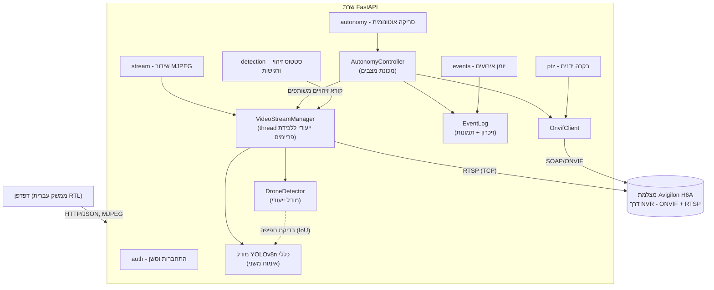
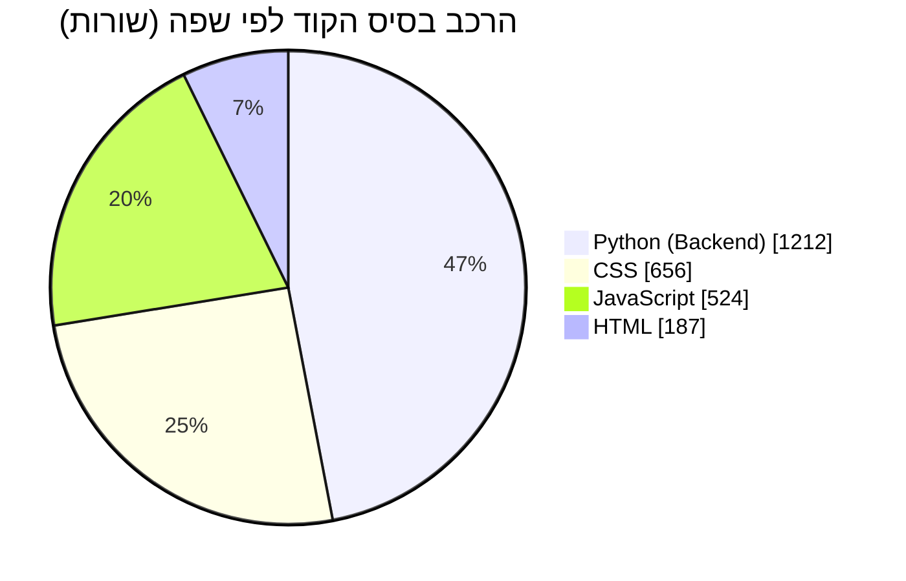
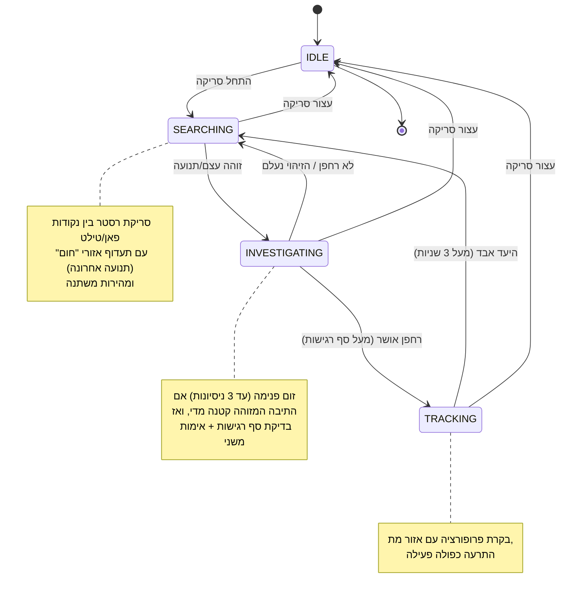
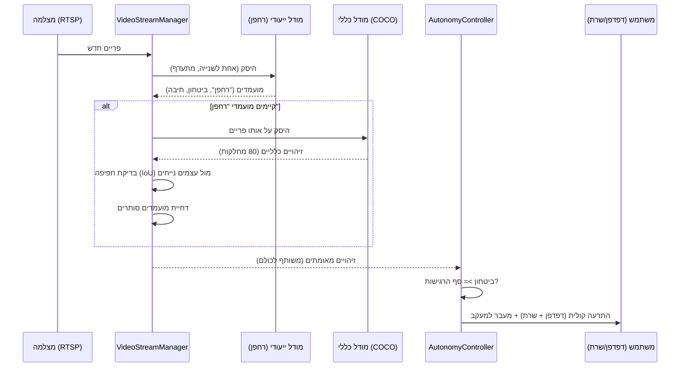

# לוח בקרה - Avigilon PTZ

[](#דרישות-מערכת)
[](#ארכיטקטורה)
[](#זיהוי-רחפנים-והפחתת-התרעות-שווא)
[](#ארכיטקטורה)
[](#ממשק-ה-api)
[-lightgrey)](#שימוש-בממשק)
[](#רישיון)

> **הערת שקיפות:** מסמך זה נכתב מחדש על בסיס ניתוח מלא של קוד המקור הקיים בפריסה הנוכחית של הפרויקט. כל פרט טכני מבוסס על הקוד בפועל. במקומות שבהם נדרשה הערכה או הנחה (לדוגמה, בהיעדר קובץ רישיון) — הדבר מסומן במפורש.

## תוכן עניינים

- [תקציר](#תקציר)
- [יכולות עיקריות](#יכולות-עיקריות)
- [ארכיטקטורה](#ארכיטקטורה)
- [מבנה הפרויקט](#מבנה-הפרויקט)
- [דרישות מערכת](#דרישות-מערכת)
- [התקנה](#התקנה)
- [הגדרות (Configuration)](#הגדרות-configuration)
- [הרצת המערכת](#הרצת-המערכת)
- [שימוש בממשק](#שימוש-בממשק)
- [מצבי המערכת האוטונומית](#מצבי-המערכת-האוטונומית)
- [זיהוי רחפנים והפחתת התרעות שווא](#זיהוי-רחפנים-והפחתת-התרעות-שווא)
- [ממשק ה-API](#ממשק-ה-api)
- [אבטחה](#אבטחה)
- [ביצועים](#ביצועים)
- [לוגים ותיעוד פעילות](#לוגים-ותיעוד-פעילות)
- [פתרון בעיות נפוצות](#פתרון-בעיות-נפוצות)
- [שאלות נפוצות](#שאלות-נפוצות)
- [מגבלות ידועות](#מגבלות-ידועות)
- [מפת דרכים](#מפת-דרכים)
- [תרומה לפרויקט](#תרומה-לפרויקט)
- [רישיון](#רישיון)

## תקציר

**לוח בקרה - Avigilon PTZ** הוא יישום Web לשליטה מרחוק במצלמת רבע-מנוע (Pan-Tilt-Zoom) מדגם Avigilon H6A, המחוברת דרך NVR של Avigilon ונגישה באמצעות פרוטוקול ONVIF.

הפרויקט התחיל כממשק שליטה ידני פשוט, והתפתח לכדי **מערכת אוטונומית לזיהוי, סיווג ומעקב אחר רחפנים**: המצלמה סורקת אזור מוגדר מראש, מזהה תנועה ועצמים בעזרת מודל ראייה ממוחשבת ייעודי, מאמתת ממצאים מול מודל כללי כדי לצמצם התרעות שווא, ובמקרה של זיהוי רחפן מהימן - משמיעה התרעה קולית (הן בדפדפן והן בשרת) ועוברת למעקב פעיל אחר היעד.

הממשק כולו בעברית, בפריסת RTL מלאה, ומיועד להפעלה על ידי מפעיל יחיד מול מצלמה פיזית אחת.

## יכולות עיקריות

| יכולת | תיאור |
|---|---|
| בקרת PTZ ידנית | פאן, טילט, זום, פוקוס, צמצם, מגב ותאורת IR - שליטה ישירה דרך ONVIF |
| סריקה אוטונומית | סריקת רסטר (Raster Scan) בין נקודות פאן/טילט הניתנות להגדרה, במהירות משתנה |
| סריקה חכמה | תעדוף אזורים שבהם זוהתה תנועה לאחרונה ("חום"), האטה סביב פעילות והאצה כשאין פעילות |
| זיהוי תנועה | ניתוח הפרשי מסגרות (Frame Differencing) קל-משקל, פועל ברציפות ובאופן עצמאי מהסריקה |
| זיהוי וסיווג רחפנים | מודל YOLO ייעודי (`best_merged.pt`) עם מחלקה יחידה - "רחפן" |
| אימות משני | הצלבה מול מודל YOLOv8n כללי (80 מחלקות COCO) לצמצום זיהויי שווא על עצמים נייחים |
| מעקב אוטומטי | בקרת פרופורציה (Proportional Control) עם אזור מת (Deadband) לייצוב התנועה |
| התרעה כפולה | צליל התרעה הן בדפדפן (Web Audio API) והן בשרת עצמו (WAV) |
| יומן אירועים | תיעוד היסטורי של תחילת/סיום סריקה, זיהויי רחפן ואיבוד יעד, כולל צילום מסך אוטומטי |
| מדדי ביצועים | קצב פריימים (FPS) וזמן היסק (Inference) מוצגים בזמן אמת |
| רגישות מתכווננת | סף הביטחון לאישור זיהוי רחפן ניתן לכיוונון חי מהממשק |
| ממשק בעברית מלאה | RTL מקיף, למעט בקרות מרחביות (פאד כיווני, טווחי מספרים) שנשארות LTR במתכוון |

## ארכיטקטורה

**Backend:** שרת FastAPI (Python), עם OpenCV לעיבוד שידור וידאו (RTSP דרך FFmpeg), ‏`onvif-zeep` לפקודות PTZ בפרוטוקול ONVIF, ו-Ultralytics YOLO לזיהוי אובייקטים.

**Frontend:** HTML5, CSS ו-JavaScript וניל טהור - **ללא שלב build**, מוגש ישירות על ידי FastAPI כקבצים סטטיים.

**זרימת נתונים כללית:**



**עקרונות מפתח בעיצוב:**

- **קריאה יחידה, לא כפולה, לזיהוי** - הזיהוי (YOLO) רץ פעם אחת בלבד בתוך `process_frame`, בתהליכון (thread) לכידת הווידאו. גם כאשר הסריקה האוטונומית פעילה וגם כאשר לא, כל צופה בשידור רואה תיבות זיהוי חיות. `AutonomyController` קורא את אותה תוצאה משותפת במקום להריץ היסק כפול.
- **בטיחות פיזית** - לולאת הבקרה האוטונומית עטופה כולה ב-`try/except` שמבטיח עצירת מצלמה בכל מקרה של שגיאה, ול-FastAPI מוגדר `shutdown handler` שעוצר את המצלמה גם אם השרת מופעל מחדש (`--reload`) תוך כדי תנועה.
- **מניעת התנגשות פקודות** - כאשר הסריקה האוטונומית פעילה, נקודות הקצה לבקרה ידנית (`/api/ptz/move`, `/stop`, `/home`) חוסמות בקשות עם קוד 409, כדי שלא "יריבו" עם הבקרה האוטונומית על המצלמה.
- **ללא שרת מיקום מוחלט מובנה** - למצלמה יש תמיכה מלאה ב-`GetStatus`/`AbsoluteMove` של ONVIF (אומת מול החומרה בפועל), ולכן הסריקה נעה בין נקודות פאן/טילט מוחלטות, ולא בהערכת זמן/מהירות בלבד.

## מבנה הפרויקט

```text
avigilon-ptz-dashboard/
├── backend/
│   ├── app/
│   │   ├── main.py              # אתחול FastAPI, middleware, ניתובי דפים
│   │   ├── config.py             # הגדרות סביבה (pydantic-settings, .env)
│   │   ├── onvif_client.py       # עטיפת onvif-zeep - PTZ, מיקום, מגבלות מכניות
│   │   ├── video_stream.py       # לכידת RTSP, זיהוי תנועה, MJPEG, מדדי ביצועים
│   │   ├── detection.py          # מודלי YOLO, אומדן מרחק, סינון זיהויי שווא
│   │   ├── autonomy.py           # מכונת המצבים של הסריקה/המעקב האוטונומיים
│   │   ├── events.py             # יומן אירועים וצילומי מסך
│   │   └── routers/
│   │       ├── auth.py           # התחברות / התנתקות / סשן
│   │       ├── ptz.py            # בקרת PTZ ידנית
│   │       ├── stream.py         # שידור MJPEG
│   │       ├── system.py         # סטטוס חיבור NVR/ONVIF
│   │       ├── autonomy.py       # התחלה/עצירה/סטטוס/מגבלות סריקה
│   │       ├── detection.py      # סטטוס זיהוי, ביצועים, רגישות
│   │       └── events.py         # יומן אירועים וצילומי מסך
│   ├── best_merged.pt            # מודל YOLO ייעודי לזיהוי רחפנים (מחלקה יחידה)
│   ├── snapshots/                # צילומי מסך שנשמרים אוטומטית באירועי זיהוי
│   ├── requirements.txt
│   └── .env.example
└── frontend/
    ├── login.html                 # עמוד התחברות (עברית, RTL)
    ├── index.html                 # לוח הבקרה הראשי (עברית, RTL)
    └── static/
        ├── css/
        │   ├── theme.css          # משתני עיצוב (צבעים, מרווחים, מעברים)
        │   └── style.css          # כל שאר העיצוב
        └── js/
            ├── app.js             # התחברות, סטטוס חיבור, עזר לפאנלים מתקפלים
            ├── video-stream.js    # שידור MJPEG עם התחברות-מחדש אוטומטית
            ├── ptz-controls.js    # בקרות לחיצה-והחזקה (Pointer Capture)
            ├── autonomy.js        # התחלה/עצירה של סריקה, טווחים, התרעה קולית
            ├── detection-status.js# תגיות תנועה/רחפן, מדדי ביצועים
            └── events.js          # יומן אירועים, מחוון רגישות
```

### הרכב הקוד (לפי שורות, נספר בפועל בעת כתיבת מסמך זה)



## דרישות מערכת

- **Python 3.10 ומעלה** (הפיתוח והבדיקות בוצעו מול Python 3.12)
- **Git** (לניהול הקוד)
- **גישת רשת** למצלמת ה-NVR של Avigilon (RTSP + ONVIF)
- **מעבד** - הרצת מודלי YOLO נתמכת גם על CPU בלבד (ללא GPU), אך ביצועי ה-Inference תלויים בחומרה.
- **מערכת הפעלה** - הפרויקט פותח ונבדק בפועל על Windows (כולל תלות ב-`winsound` להתרעה קולית בצד השרת). ליבת ה-Backend מבוססת Python טהור ותיאורטית ניידת, אך ההתרעה הקולית בצד השרת ספציפית ל-Windows.

### חומרת הבדיקה בפועל

הפרויקט פותח ונבדק בפועל על מחשב עם המפרט הבא (ללא GPU ייעודי):

| רכיב | פרט |
|---|---|
| מעבד | Intel(R) Pentium(R) Gold G5400 CPU @ 3.70GHz (2 ליבות פיזיות / 4 חוטים) |
| כרטיס מסך | Intel(R) UHD Graphics 610 (מובנה, ללא GPU נפרד) |
| אחסון | כונן SSD (SATA) + כונן HDD נפרד |

**זו נקודת ייחוס אמיתית, לא דרישת מינימום רשמית** - על חומרה חלשה מסוג זה בוצעו אופטימיזציות ספציפיות (ראו [ביצועים](#ביצועים)), כגון הגבלת מספר ה-threads של PyTorch לאחד בלבד כדי לא להשתלט על שני הליבות הפיזיות היחידות באמצע קריאת Inference.

## התקנה

```bash
# 1. יצירת סביבה וירטואלית
python -m venv venv

# 2. הפעלת הסביבה הווירטואלית
# Windows:
venv\Scripts\activate
# macOS/Linux:
source venv/bin/activate

# 3. התקנת תלויות בסיס
pip install -r backend/requirements.txt
```

> **הערה חשובה - CPU מול GPU:** קובץ ה-`requirements.txt` כולל את `torch`, `torchvision` ו-`ultralytics` הנדרשים לזיהוי הרחפנים. אם מריצים `pip install` ללא ציון מפורש, ניתן לקבל בטעות גרסת CUDA כבדה (מספר GB) גם על מכונה ללא GPU. אם נדרש להתקין אותם בנפרד, יש לציין את מאגר ה-CPU במפורש:
>
> ```bash
> pip install torch torchvision --index-url https://download.pytorch.org/whl/cpu
> pip install ultralytics
> ```

```bash
# 4. הגדרת משתני סביבה
cp backend/.env.example backend/.env      # macOS/Linux
copy backend\.env.example backend\.env    # Windows
```

ולאחר מכן יש לערוך את `backend/.env` (ראו טבלת [הגדרות](#הגדרות-configuration) למטה).

## הגדרות (Configuration)

כל ההגדרות נטענות מקובץ `backend/.env` (מבוסס `pydantic-settings`):

| משתנה | תיאור | ברירת מחדל |
|---|---|---|
| `NVR_IP` | כתובת ה-IP של ה-NVR (או של המצלמה עצמה, אם היא חשופה ישירות ברשת) | - |
| `NVR_PORT` | פורט RTSP לשליפת השידור | `554` |
| `ONVIF_PORT` | פורט בקרת ONVIF/PTZ | `80` |
| `NVR_USERNAME` | שם משתמש להתחברות ל-NVR/למצלמה | - |
| `NVR_PASSWORD` | סיסמה להתחברות ל-NVR/למצלמה | - |
| `CAMERA_CHANNEL_ID` | מזהה הערוץ (אינדקס 0) של המצלמה ב-NVR | `0` |
| `DASHBOARD_USERNAME` | שם משתמש לכניסה ללוח הבקרה עצמו (נפרד מפרטי ה-NVR) | - |
| `DASHBOARD_PASSWORD` | סיסמה ללוח הבקרה | - |
| `SESSION_SECRET_KEY` | מחרוזת אקראית וארוכה לחתימת cookie הסשן | - |

> **הערת אבטחה:** יש להשתמש בסיסמאות חזקות וב-`SESSION_SECRET_KEY` אקראי אמיתי בכל סביבה שאינה מבודדת לחלוטין מרשת חיצונית. קובץ ה-`.env` אינו אמור להיכלל בבקרת גרסה.

### מגבלות מיכניות של המצלמה

`OnvifClient.get_pan_tilt_limits()` שולף מהמצלמה עצמה (דרך `PTZConfiguration.PanTiltLimits`) את טווח הפאן/טילט המכני האמיתי הנתמך, ומשתמש בו כדי להגביל כל בקשת טווח סריקה שמגיעה מהממשק - כך שלא ניתן לבקש מהמצלמה לנוע מעבר לטווח הפיזי שלה גם אם המשתמש הזין ערכים גדולים יותר.

## הרצת המערכת

מתוך תיקיית `backend/`:

```bash
uvicorn app.main:app --reload
```

או לחלופין:

```bash
python -m app.main
```

לוח הבקרה יהיה זמין בכתובת `http://localhost:8000`, ויפנה אוטומטית לעמוד ההתחברות אם אין סשן פעיל.

## שימוש בממשק

1. **התחברות** - עמוד הכניסה דורש את `DASHBOARD_USERNAME`/`DASHBOARD_PASSWORD` שהוגדרו ב-`.env`.
2. **בקרה ידנית** - פאד כיווני, זום, פוקוס וצמצם בתחתית המסך. הלחיצה-והחזקה (press-and-hold) מפעילה תנועה רציפה עד לשחרור העכבר/האצבע, תוך שימוש ב-Pointer Capture כדי שהתנועה לא תיפסק בטעות אם הסמן חורג מגבולות הכפתור.
3. **הגדרת טווח סריקה** - שדות "פאן" ו"הטיה" בלוח הצד מוצגים בסולם ידידותי של ‎-100‎ עד ‎100‎ (ולא בסולם ה-ONVIF הגולמי של ‎-1‎ עד ‎1‎), וממולאים מראש בטווח המכני האמיתי של המצלמה.
4. **התחלת סריקה** - הכפתור "התחל סריקה" מפעיל את המצלמה האוטונומית: היא סורקת את הטווח שהוגדר, מזהה תנועה ועצמים, חוקרת ממצאים (כולל זום פנימה במידת הצורך), ועוברת למעקב אם זוהה רחפן בביטחון מספק.
5. **רגישות זיהוי** - מחוון "רגישות זיהוי רחפן" קובע את סף הביטחון המינימלי הנדרש כדי לאשר זיהוי רחפן ולעבור למעקב.
6. **יומן אירועים** - פאנל מתקפל המציג את היסטוריית האירועים האחרונה (התחלת/סיום סריקה, זיהוי רחפן, איבוד יעד), כולל תמונה ממוזערת לאירועי זיהוי.
7. **בקרות עזר** - הפעלת/כיבוי מגב ותאורת IR.

## מצבי המערכת האוטונומית

`AutonomyController` מיושם כמכונת מצבים (State Machine) הרצה בתהליכון (thread) נפרד, המופעל ומופסק על פי דרישה (בניגוד לתהליכון לכידת הווידאו, שרץ תמידית):



## זיהוי רחפנים והפחתת התרעות שווא

המודל הייעודי (`best_merged.pt`) מאומן על **מחלקה יחידה בלבד - "רחפן"**. המשמעות המעשית: המודל אינו יכול לומר "זה כיסא, לא רחפן" - הוא יכול רק להצביע על "רחפן" בביטחון מסוים, ולכן עלול לזהות בטעות עצמים נייחים כרחפן בביטחון בינוני.

כדי לצמצם את הבעיה, כל מועמד "רחפן" מוצלב אוטומטית מול **מודל YOLOv8n כללי, מאומן מראש על 80 מחלקות COCO**. אם המודל הכללי מזהה באותו אזור (בחפיפה גיאומטרית, לפי IoU) עצם נייח מוכר בביטחון גבוה - כיסא, ספה, שולחן, מזוודה, תיק, עציץ ועוד - הזיהוי נדחה כזיהוי שווא סביר.



> **חשוב להבין:** מכיוון של-COCO אין מחלקת "רחפן" או "כלי טיס", המודל הכללי יכול **רק לשלול** זיהוי ("זה נראה כמו כיסא ולא כמו רחפן"), ולעולם לא **לאשר** זיהוי באופן חיובי. זהו כלי עזר הֶאוריסטי לצמצום זיהויי שווא, לא הוכחה מדעית לנוכחות רחפן.

### אומדן מרחק - הערכה גסה בלבד

כאשר מזוהה רחפן, המערכת מציגה הערכת מרחק גסה (לדוגמה "~12 מ'"), המחושבת לפי גודל התיבה המזוהה בפיקסלים והנחת שדה ראייה אופקי (HFOV) של 60 מעלות ורוחב רחפן ייחוס של 0.35 מטר. **המצלמה אינה מכוילת מרחק ואין בה חיישן טווח (לייזר/רדאר)** - לכן מדובר בסדר גודל בלבד, לא במדידה מדויקת. הסבר זה מוצג גם למשתמש בממשק עצמו (פאנל "מידע על טווח זיהוי").

## ממשק ה-API

כל נקודות הקצה (למעט התחברות וסטטוס מערכת בסיסי) דורשות סשן מחובר (`require_auth`).

| נתיב | Method | תיאור |
|---|---|---|
| `/login`, `/` | GET | הגשת עמודי הכניסה/הלוח הראשי |
| `/api/auth/login` | POST | התחברות (שם משתמש + סיסמה) |
| `/api/auth/logout` | POST | התנתקות |
| `/api/system/status` | GET | סטטוס חיבור ל-NVR/ONVIF (ללא צורך באימות) |
| `/api/stream/mjpeg` | GET | שידור וידאו חי (multipart MJPEG) |
| `/api/ptz/move` | POST | תנועה ידנית (פאן/טילט/זום) - חסום ב-409 אם הסריקה האוטונומית פעילה |
| `/api/ptz/stop` | POST | עצירת תנועה - חסום ב-409 בסריקה אוטונומית |
| `/api/ptz/home` | POST | חזרה למיקום בית - חסום ב-409 בסריקה אוטונומית |
| `/api/ptz/focus`, `/api/ptz/iris`, `/api/ptz/aux` | POST | פוקוס, צמצם, ופקודות עזר (מגב/IR) |
| `/api/autonomy/start` | POST | התחלת סריקה אוטונומית (טווח פאן/טילט בסולם ‎-100..100‎) |
| `/api/autonomy/stop` | POST | עצירת הסריקה האוטונומית |
| `/api/autonomy/status` | GET | מצב נוכחי, האם התרעה פעילה, זיהוי אחרון |
| `/api/autonomy/limits` | GET | טווח הפאן/טילט המכני האמיתי של המצלמה |
| `/api/detection/status` | GET | סטטוס תנועה, זיהוי רחפן ומדדי ביצועים (FPS, זמן היסק) |
| `/api/detection/sensitivity` | GET/POST | קריאה/עדכון של סף הביטחון לאישור זיהוי רחפן |
| `/api/events` | GET | 50 האירועים האחרונים (ניתן לשינוי בפרמטר `limit`) |
| `/api/events/snapshots/{filename}` | GET | תמונת אירוע (מוגש דרך נקודת קצה מאומתת, לא כתיקייה סטטית ציבורית) |

## אבטחה

- **אימות מבוסס סשן** - Cookie חתום (`itsdangerous` דרך `SessionMiddleware` של Starlette), נפרד לחלוטין מפרטי ההתחברות ל-NVR עצמו.
- **צילומי מסך אינם ציבוריים** - תמונות אירועים (עלולות לכלול מידע רגיש על המיקום המצולם) מוגשות אך ורק דרך נקודת קצה הדורשת אימות, עם בדיקת תקינות שם קובץ מחמירה (Regex) המונעת ניצול למעבר בין תיקיות (Path Traversal).
- **מניעת התנגשות שליטה** - פקודות PTZ ידניות נחסמות (409) בזמן סריקה אוטונומית, כדי שמשתמש שני (או לשונית ישנה שנשארה פתוחה) לא "יריב" עם הבקרה האוטונומית על אותה מצלמה בו-זמנית.
- **החלמה מקריסה** - אם לולאת הבקרה האוטונומית נכשלת מכל סיבה, המערכת מבטיחה עצירת מצלמה ואיפוס מצב ל-IDLE, כדי שלא תישאר "תקועה" במצב פעיל ללא בקרה.

> **הערה:** קובץ ה-`.env.example` בפרויקט מכיל ערכי דוגמה בלבד. יש לוודא שקובץ `.env` בפועל, עם פרטי הרשת והאימות האמיתיים, **אינו** נכלל בבקרת גרסה ואינו משותף.

## ביצועים

- **זיהוי מתועדף (Throttled)** - היסק ה-YOLO רץ פעם בשנייה כברירת מחדל (`DETECTION_INTERVAL_SECONDS`), ולא על כל פריים, כדי לא "להרעיב" את תהליכון לכידת הווידאו.
- **thread יחיד ל-PyTorch** - `torch.set_num_threads(1)`. במעבד דו-ליבתי (ראו [חומרת הבדיקה בפועל](#חומרת-הבדיקה-בפועל)), שני threads להיסק היו משתלטים על שתי הליבות הפיזיות כולן במהלך כל קריאת Inference (כ-250 מילישניות), ומרעיבים את תהליכון לכידת הווידאו ואת שרת ה-API. thread יחיד מאט מעט את ההיסק עצמו, אך משאיר ליבה פנויה לשאר המערכת - בממשק חי, זו העדפה נכונה.
- **ללא העתקות פריים מיותרות** - לולאת הבקרה האוטונומית רצה 20 פעמים בשנייה, אך זקוקה רק לממדי הפריים (רוחב/גובה), לא לתוכן הפיקסלים בפועל. לכן היא משתמשת ב-accessor זול (`get_latest_frame_shape`) במקום להעתיק פריים מלא (כ-6MB) בכל טיק - העתקת הפריים המלאה נשמרת רק לרגע שבו נשמר צילום מסך אמיתי (אירוע זיהוי רחפן).
- **ללא Middleware מיותר** - הוסר Middleware ניפוי-באגים זמני שרשם ללוג כל בקשת HTTP; היה מדפיס פעמיים (עם `flush` חוסם) על כל בקשה, כולל מתוך מספר לולאות polling מקבילות בממשק.
- **זיהוי תנועה קל-משקל** - הפרשי מסגרות (Frame Differencing) בגווני אפור רצים על כל פריים, ללא תלות בהיסק ה-YOLO היקר יותר.
- **שקיפות מדידה** - קצב הפריימים בפועל (FPS) וזמן ההיסק האחרון מוצגים בממשק בזמן אמת, ולא כערך תיאורטי.
- **מגבלת חומרה ידועה** - זמני היסק בפועל (כ-200-300 מילישניות לפריים במכונת הבדיקה) תלויים לחלוטין בחומרה שעליה מותקנת המערכת.

## לוגים ותיעוד פעילות

- לוגים טכניים (בקשות HTTP, פעולות סריקה, שגיאות היסק) נכתבים ל-stdout של השרת בפורמט טקסט חופשי (`print`), מיועדים לפיתוח ואבחון ולא למערכת ניטור מרכזית.
- **יומן אירועים למשתמש** (נפרד מהלוגים הטכניים) - נשמר בזיכרון בלבד (מבנה `deque` בגודל מוגבל, 100 אירועים אחרונים), **ולא נשמר בין הפעלות שרת**. אירוע זיהוי רחפן שומר גם צילום מסך בתיקיית `backend/snapshots/`.

## פתרון בעיות נפוצות

| תסמין | סיבה אפשרית | פתרון |
|---|---|---|
| השידור לא עולה / "מתחבר מחדש לשידור..." בלולאה | בעיית תעבורת UDP מול חומת אש/NAT | המערכת כבר מכריחה תעבורת RTSP דרך TCP (`OPENCV_FFMPEG_CAPTURE_OPTIONS`); יש לוודא שאין חסימת רשת בין השרת למצלמה |
| כניסה נכשלת ללא הודעת שגיאה, העמוד "מתאפס" | הדפדפן חוסם עוגיות (Cookies) לאתר, או Extension מתערב | לבדוק הגדרות Cookies בדפדפן; לנסות חלון גלישה בפרטיות |
| פקודת PTZ ידנית מחזירה 409 | הסריקה האוטונומית פעילה כרגע | יש לעצור את הסריקה האוטונומית לפני שליטה ידנית |
| זיהויי "רחפן" שגויים חוזרים ונשנים | המודל הייעודי בעל מחלקה יחידה, נוטה לזיהויי שווא | לכוונן את מחוון הרגישות כלפי מעלה; להסתמך על האימות המשני; לזכור שזו מגבלה ידועה של המודל |
| התקנת `torch`/`ultralytics` איטית מאוד או מוריד קבצים ענקיים | הותקנה גרסת CUDA במקום CPU | להתקין מפורשות עם `--index-url https://download.pytorch.org/whl/cpu` (ראו [התקנה](#התקנה)) |
| אין קול התרעה בשרת עצמו | ייתכן שאין רמקול/פלט שמע פעיל במחשב השרת | ודאו התקן שמע פעיל; ההתרעה משתמשת ב-`winsound.PlaySound` על קובץ WAV זמני, לא ב-`Beep` הישן |

## שאלות נפוצות

**האם המערכת יכולה למדוד מרחק מדויק לרחפן?**
לא. הערכת המרחק היא הערכה גסה בלבד, המבוססת על גודל התיבה המזוהה והנחות לגבי שדה הראייה וגודל הרחפן. אין במערכת חיישן טווח ייעודי.

**האם ניתן להריץ את המערכת מול כמה מצלמות בו-זמנית?**
לא בפריסה הנוכחית. הארכיטקטורה (Singletons כגון `get_video_stream_manager`, `get_onvif_client`, `get_autonomy_controller`) מניחה מצלמה פיזית יחידה לכל הפעלת שרת.

**האם יש שמירה מתמשכת (מסד נתונים) של יומן האירועים?**
לא. יומן האירועים נשמר בזיכרון בלבד ומתאפס עם הפעלה מחדש של השרת. צילומי המסך עצמם נשארים על הדיסק בתיקיית `snapshots/`.

**האם ניתן להשתמש במודל זיהוי אחר?**
כן - `backend/app/detection.py` טוען את המודל הייעודי מהקובץ `best_merged.pt` ואת המודל הכללי מ-`yolov8n.pt` (מורד אוטומטית). ניתן להחליף את שני הקבצים במודלים אחרים התואמים לפורמט Ultralytics YOLO.

## מגבלות ידועות

- **ללא כיול מרחק אמיתי** - כל נתוני המרחק/הטווח בממשק הם הערכה בלבד (ראו סעיף [זיהוי רחפנים](#זיהוי-רחפנים-והפחתת-התרעות-שווא)).
- **מודל בעל מחלקה יחידה** - עלול להניב זיהויי שווא על עצמים נייחים; מנוטרל חלקית על ידי האימות המשני, לא באופן מוחלט.
- **ללא שמירה מתמשכת** - יומן האירועים אינו נשמר במסד נתונים ומתאפס בהפעלה מחדש.
- **מצלמה פיזית יחידה** - אין תמיכה מובנית בריבוי מצלמות/NVRs בו-זמנית.
- **תלות ב-Windows להתרעה בצד השרת** - `winsound` הוא מודול סטנדרטי של Windows בלבד; בהרצה על מערכת הפעלה אחרת יש להחליף את מנגנון ההתרעה בצד השרת.
- **סריקה חכמה מבוססת חום, לא חיזוי תנועה** - תעדוף האזורים ה"חמים" הוא מנגנון היוריסטי (עלייה/דעיכה של ציון פעילות), ולא מודל חיזוי תנועה מבוסס פיזיקה (כדוגמת מסנן קלמן).

## מפת דרכים

רעיונות להרחבה עתידית שזוהו אך **טרם מומשו** בפריסה הנוכחית:

- אזורי זיהוי (Detection Zones) מוגדרים על גבי תמונת הווידאו
- מפת חום (Heatmap) מצטברת של אזורי פעילות
- הקלטת וידאו רציפה, לא רק צילומי מסך נקודתיים
- גרפים היסטוריים של רמות ביטחון וזיהויים לאורך זמן
- סטטוס תקינות חיישנים/מנועים (Servo Health)
- פרופילי התרעה קוליים הניתנים להתאמה אישית
- מעבר בין מספר תבניות סריקה
- תמיכה בריבוי מצלמות

## תרומה לפרויקט

הפרויקט אינו כולל כיום קובץ הנחיות תרומה (`CONTRIBUTING.md`) או תהליך Pull Request מוגדר. מפתחים המעוניינים לתרום מוזמנים לפעול לפי העקרונות הבאים, העולים מהמבנה הקיים של הקוד:

- שמירה על הפרדת אחריות בין נתבים (`routers/`) לבין הלוגיקה העסקית (`autonomy.py`, `video_stream.py`, `detection.py`).
- הימנעות מהוספת שכבת Build לצד הלקוח - הפרונט-אנד נשאר HTML/CSS/JS וניל במתכוון.
- כל שינוי המשפיע על תנועת PTZ בפועל (פקודות `continuous_move`/`absolute_move`) יש לבדוק מול חומרה אמיתית, בזהירות, מכיוון שמדובר בציוד פיזי הנע בפועל.

## רישיון

**⚠️ הערת שקיפות:** לא נמצא קובץ `LICENSE` בפריסה הנוכחית של המאגר. יש להוסיף קובץ רישיון מפורש (לדוגמה MIT, Apache 2.0, או רישיון קנייני פנים-ארגוני) בהתאם למדיניות הארגון, לפני הפצה או פרסום הפרויקט מחוץ לסביבת הפיתוח הנוכחית.
