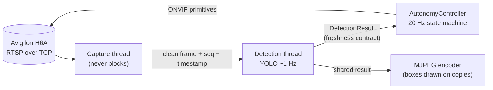
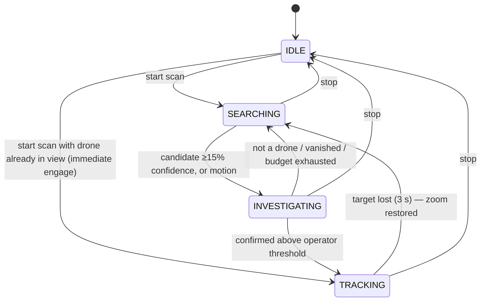

# Autonomous Avigilon PTZ Drone-Detection Dashboard

[](#getting-started)
[](#core-architecture)
[](#the-autonomy-engine)
[](#core-architecture)
[](#hardware--environment-profile)
[](#core-architecture)

An autonomous counter-drone surveillance system built around a single Avigilon H6A PTZ camera. The camera continuously scans an operator-defined zone, investigates motion and detection candidates by actively adjusting its own zoom until it can classify them with confidence, and — when a drone is confirmed — locks on, tracks it with closed-loop visual servoing, and raises a dual (server + browser) alarm. A human operator retains unconditional override authority at all times.

The entire autonomy stack is custom-built and vendor-neutral: the camera is driven exclusively through primitive ONVIF commands, with no reliance on vendor tours, presets, or built-in analytics.

> **Transparency note:** this document describes only what the code actually does. Where behavior is heuristic or approximate (distance estimation, zoom restoration, single-class model limits), that is stated explicitly.

---

## Table of Contents

- [Core Architecture](#core-architecture)
- [The Autonomy Engine](#the-autonomy-engine)
- [Key Features](#key-features)
- [Hardware & Environment Profile](#hardware--environment-profile)
- [Getting Started](#getting-started)
- [Operations & Tuning](#operations--tuning)
- [Testing](#testing)
- [Roadmap](#roadmap)
- [Known Limitations](#known-limitations)
- [License](#license)

---

## Core Architecture

**Backend** — FastAPI (Python). OpenCV/FFmpeg ingests the camera's RTSP stream (forced over TCP for firewall/NAT resilience); `onvif-zeep` issues PTZ commands; Ultralytics YOLO performs detection. A custom single-class drone model (`best_merged.pt`) is cross-checked against a general 80-class COCO model (`yolov8n.pt`) that geometrically vetoes (IoU overlap) drone candidates confidently classified as ordinary stationary objects — cutting false alarms from chairs, plants, and furniture.

**Frontend** — deliberately build-free vanilla HTML/CSS/JS (Hebrew, full RTL), served directly by FastAPI. The dashboard is a **viewport-locked, zero-scroll application shell**: a `100vh` CSS grid (topbar / main / PTZ bar) in which the event log's list is the only scrollable region. Every control, the live feed, and the alarm state are permanently visible on one screen.

### The decoupled inference pipeline

The load-bearing architectural decision on this hardware:



- **YOLO inference runs on a dedicated thread, never in the capture path.** A 200–300 ms inference call inside the capture loop would back frames up in the RTSP buffer, so live-view latency would grow *exactly when a threat appears*. The detection thread always consumes the newest frame and simply skips frames it cannot keep up with.
- **Every detection result is stamped with the frame's sequence number and capture timestamp** (`DetectionResult`). This freshness contract lets the 20 Hz control loop distinguish evidence captured *after* its last camera adjustment from stale, pre-move results — the foundation of reliable investigation and tracking at a ~1 Hz measurement rate.
- **Stored frames are always clean.** Detection overlays are drawn on copies at MJPEG-encode and snapshot time, so archived event imagery and any future consumer receive unmodified pixel data.
- **Camera-motion-aware motion detection.** Frame-differencing is meaningless while a PTZ camera pans (every pixel changes), so the ONVIF client tracks the camera's own motion state from its commands and status polls, and motion detection is suppressed during moves plus a short mechanical-settle window — making "motion" a trustworthy investigation trigger instead of scan-induced noise.

## The Autonomy Engine

A custom state machine (`backend/app/autonomy.py`) running at 20 Hz on its own thread:



**SEARCHING — boustrophedon scanning with heat prioritization.** The operator's pan/tilt zone is covered by a zigzag waypoint raster driven by ONVIF `AbsoluteMove` with closed-loop arrival detection (status polling + timeout fallback). The scan **dwells ~1.2 s at each waypoint** so both the motion detector and the ~1 Hz detector get a stationary, blur-free look at every sector. Waypoints near recent activity accumulate decaying "heat" and are revisited out of order and swept slowly — bounded so a stubborn false positive can never capture the scan permanently.

**INVESTIGATING — confidence-seeking zoom loops.** When triggered, the camera stops and actively works to *identify*: zooming **in** for more pixels on small targets, or **out** for context when the box already fills the frame — up to four non-blocking zoom pulses. Each step is evaluated only against detection results computed from frames captured after the adjustment settled. A motion-only trigger holds a stationary stare for up to 2.5 s. Give-up paths undo the net zoom applied, restoring the operator's original framing.

**TRACKING — "Move-Settle-Measure" visual servoing for low-end hardware.** Proportional control with a deadband centers the target, and bang-bang zoom holds it at a consistent scale. Because measurements arrive at only ~1 Hz on this CPU, corrections are **computed once per fresh detection result and time-boxed (~0.45 s): move a little, stop, re-measure** — rather than letting a command derived from a second-old bounding box run continuously into overshoot. Confidence hysteresis (lock held at 60% of the confirm threshold) prevents momentary dips from dropping a lock that took an investigation to acquire. On loss, the net zoom autonomy applied is unwound before the scan resumes.

## Key Features

| Feature | Detail |
|---|---|
| **Unconditional manual override** | Any manual PTZ command *stops* the autonomous scan and executes — the operator always wins, never a "busy" rejection. An on-screen hint communicates the takeover behavior. |
| **Alarm with operator acknowledge** | Dual alarm (server-side tone on Windows, Web-Audio tone in every browser) with a dismiss control that silences without disturbing an active track; re-arms on the next confirmed detection. |
| **First-run configuration panel** | NVR/ONVIF connection settings editable from the dashboard (gear icon) with a live connection test — no `.env` hand-editing. Values are written atomically with full quoting/escaping, credentials never round-trip to the browser, and the server boots cleanly with no configuration at all. |
| **Session telemetry & tuning reports** | Every run auto-writes a timestamped session log (`backend/logs/`); `backend/scripts/summarize_telemetry.py` (stdlib-only) turns it into a tuning report — inference latency distribution, waypoint travel/timeout rates, investigation outcomes, tracking cadence, deadband ratio — with data-driven tuning hints. |
| **Event log with evidence** | Scan lifecycle, confirmed detections (with annotated snapshot), and target-loss events, permanently visible in the single-screen UI. |
| **Deliberate no-auth design** | No login, sessions, or accounts — by explicit architectural decision, for deployment on **isolated/trusted networks only**. Every endpoint, including live video and PTZ control, is open to anyone who can reach the server; do not expose it to untrusted networks. |

## Hardware & Environment Profile

Designed for **edge deployment on genuinely constrained hardware** — the reference machine is an Intel Pentium G5400 (2 cores / 4 threads), integrated UHD 610 graphics, **no discrete GPU**:

- PyTorch is pinned to a **single thread**: on a 2-core CPU, multi-threaded inference saturates both physical cores for the duration of every call, starving video capture and the API. One slightly slower inference call that leaves a core free beats a faster one that freezes the UI.
- Inference is throttled (~1 Hz), doubled only when a drone candidate needs COCO cross-checking — and that verification pass is **skipped during TRACKING**, halving inference cost precisely when sustained load matters.
- The 20 Hz control loop reads frame *dimensions* through cheap accessors; full ~6 MB frame copies happen only at snapshot time.
- **No vendor lock-in:** the camera is driven purely through primitive ONVIF operations (`AbsoluteMove`, `ContinuousMove`, `Stop`, `GetStatus`, `SendAuxiliaryCommand` for wiper/IR). Any ONVIF-compliant PTZ camera with absolute positioning support is a candidate target; nothing depends on Avigilon-specific analytics, tours, or SDKs.
- **Cross-platform backend:** developed for Windows deployment, but runs on any OS — the Windows-only server-side alarm (`winsound`) is lazily imported and degrades to a no-op elsewhere (the browser alarm always sounds).

## Getting Started

```bash
# 1. Clone and create a virtual environment
git clone https://github.com/aviayeli/avigilon-ptz-dashboard.git
cd avigilon-ptz-dashboard
python -m venv venv

# 2. Activate it
venv\Scripts\activate          # Windows
source venv/bin/activate       # Linux / macOS

# 3. Install dependencies (CPU-only torch — avoid the multi-GB CUDA build)
pip install torch torchvision --index-url https://download.pytorch.org/whl/cpu
pip install -r backend/requirements.txt

# 4. Run (from backend/)
cd backend
uvicorn app.main:app
```

Open `http://localhost:8000`. On first run, use the **gear icon** in the topbar to enter the NVR address, credentials, and camera channel, test the connection, save — then restart the server to apply. (Alternatively, copy `backend/.env.example` to `backend/.env` and edit by hand.)

## Operations & Tuning

- Every server run writes `backend/logs/session-<timestamp>-<pid>.log` with per-line `HH:MM:SS` stamps.
- `python backend/scripts/summarize_telemetry.py` summarizes the newest session (or pass a path) into a tuning report; its hints only fire on measured thresholds.
- All behavioral constants (scan speeds, dwell, investigation budget, deadband, correction time-box, settle windows) are named constants at the top of `backend/app/autonomy.py` and `backend/app/video_stream.py`, each documented with its rationale. Tune one at a time against telemetry.

## Testing

```bash
python backend/tests/test_state_machine.py
```

Runs the **real** autonomy control loop against a fake ONVIF client and controllable detection results, with all heavy dependencies (torch, OpenCV, onvif) stubbed — 24 scenarios covering both investigation triggers, evidence-freshness gating, the zoom loop's give-up path, tracking hysteresis, target loss with zoom restore, immediate engagement, and stop responsiveness. Requires nothing installed beyond Python; runs on any machine in ~25 s.

## Roadmap

Prioritized, pending calibration data from physical hardware testing:

1. **OpenVINO inference backend** — expected 2–4× YOLO speedup on the Intel edge CPU via Ultralytics' native export.
2. **ROI-cropped inference during tracking** — raising the effective measurement rate exactly when it matters.
3. **Alpha-beta target prediction** — velocity-based prediction between the ~1 Hz measurements for faster targets (deliberately chosen over a full Kalman filter until data justifies one).
4. **Zoom-aware control gains** — scaling correction velocity by zoom level (pending hardware confirmation of zoom position readback).
5. **Offline one-click Windows deployment** — Inno Setup installer bundling an embeddable Python runtime, all wheels, and both model weights (no internet required on isolated networks), with a launcher that starts the server and opens the dashboard as a chromeless Edge application window.

Additional reliability items: target re-acquisition sweep, capture watchdog, persistent event log, automated lens-wiper triggering (in data-collection phase).

## Known Limitations

- **Distance estimates are rough indications only** — derived from box size with an assumed field of view and reference drone width; there is no rangefinder and no calibration.
- **Single-class detector** — the drone model can only assert "drone-ness" with some confidence; the COCO cross-check mitigates but cannot eliminate false positives on unusual stationary objects.
- **Single camera per server instance** — the architecture assumes one physical camera.
- **Event log is in-memory** — cleared on restart (snapshots persist on disk).
- **Tracking is measurement-rate-bound** — at ~1 Hz effective cadence, very fast or close targets can outrun the correction cycle (see Roadmap items 1–3).

## License

**No license file is currently present** — this repository is unlicensed (all rights reserved by default) and not yet cleared for distribution. Note in particular that the Ultralytics YOLO dependency is **AGPL-3.0**: distributing this software to third parties requires either AGPL-compliant source release or an Ultralytics commercial license. Resolve before any external release.
